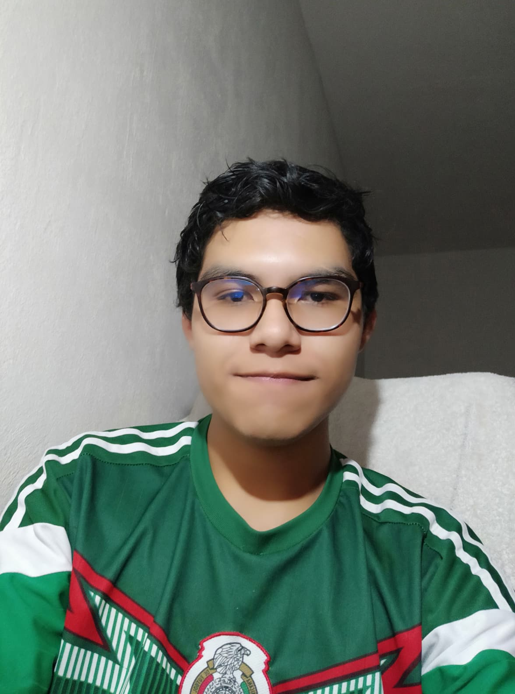
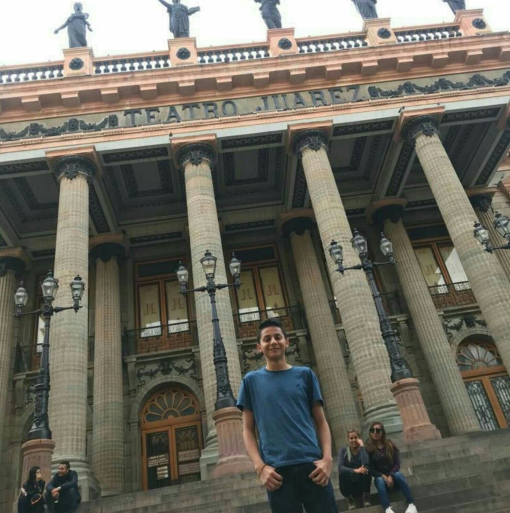
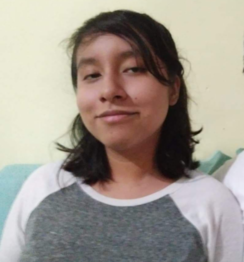
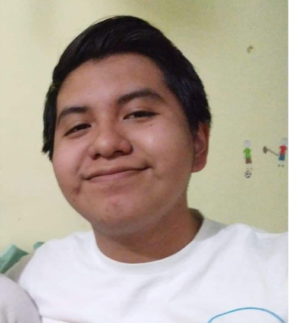

<!DOCTYPE html>
<html>
<head>
	<title>Tabla</title>
	<meta charset="utf-8">
	<link rel="stylesheet" type="text/css" href="tabla.css">
</head>
<body>
	
<h1> Jig 15 Tabla Estilos Sm8 </h1>

	

		<h2>Datos personales</h2>
		
		
		
		
<strong>Nombre:</strong> Gallardo Licea Evelyn Naomi 4 " <strong>Grado y grupo: </strong> 4"F"  <strong>Materia: </strong> DESAPEJES <strong>Maestro: </strong>Jorge Silva Granados 

	

	

		
  <h2>Tabla de Liderazgo</h2>
<table>
 <tr>
   <th>Nombre</th>
   <th>Impulsor</th>
   <th>Implementador</th>
   <th>Finalizador</th>
   <th>Cohesionador</th>
   <th>Coordinador</th>
   <th>Investigador</th>
   <th>Cerebro</th>
   <th>Evaluador</th>
   <th>Especialista</th>
 </tr>
 <tr>
   <td>
   		Becerra Aguirre Sergio Alejandro 
	   
   </td>
   <td>
	<ul>
		<li>Energico</li>
		<li>Dinamico</li>
		<li>Coraje</li>
	</ul> </td>
   <td>

</td>
   <td>

</td>
   <td>
   	<ul>
   		<li>Cooperador</li>
   		<li>Apacible</li>
   		<li>Perceptivo</li>
   		<li>Ayuda al equipo</li>
   	</ul></td>
   <td>

</td>
   <td>
   	<ul>
   		<li>Contactos</li>
   	</ul></td>
   <td>
   	<ul>
   		<li>Creativo</li>
   		<li>Ignora los incidentes</li>
   	</ul></td>
   <td>

</td>
   <td>
   	<ul>
   		<li>Cualidades y conocimientos especificos</li>
   		<li>Contribución cuando conoce bien el tema </li>   	
   		<li>Uso de tecnicismos</li>
   	</ul></td>
 </tr>
 <tr>
   <td>
   		Rodriguez Herrera Hilario Martin 
   		
   </td>
   <td>
   	<ul>
   		<li>Enérgetico</li>
   		<li>Retador</li>
   		<li>Dinámico</li>
   		<li>Iniciativa</li>
   		<li>Coraje</li>
   	</ul></td>
   <td>
   	<ul>
   		<li>Estrategia</li>
   		<li>Eficiente</li>
   	</ul></td>
   <td>

</td>
   <td>
   	<ul>
   		<li>Cooperador</li>
   		<li>Perceptivo</li>
   		<li>Diplomatico</li>
   		<li>Ayuda al equipo</li>
   	</ul></td>
   <td>

</td>
   <td>
   	<ul>
   		<li>Contactos</li>
   		<li>Extrovertido</li>
   		<li>Comunicativo</li>
   	</ul></td>
   <td>
   	<ul>
   		<li>Cretivo</li>
   		<li>Soluciones</li>
   		<li>Ignora incidentes</li>
   	</ul></td>
   <td>

</td>
   <td>
   	<ul>
   		<li>Cualidades y conocimientos especificos</li>
   		<li>Contribuye al conocer el tema
   		<li>Uso de tecnicismos</li>
   		</li>
   	</ul></td>
 </tr>
 <tr>
   <td>
   		Guevara Solano Xavier 
   		
   </td>
   <td>
   	<ul>
   		<li>Retador</li>
   		<li>Dinámico</li>
   	</ul></td>
   <td>

</td>
   <td>

</td>
   <td>

</td>
   <td>
   	<ul>
   		<li>Seguro de si mismo</li>
   		<li>Promueve toma de decisiones</li>
   		<li>Percepción manipuladora</li>
   	</ul></td>
   <td>
   	<ul>
   		<li>Contactos</li>
   		<li>Extrovertido</li>
   	</ul></td>
   <td>

</td>
   <td>
   	<ul>
   		<li>Punto de vista lógico</li>
   		<li>Imparcial</li>
   		<li>Estrategia</li>
   	</ul></td>
   <td>

</td>
 </tr>
 <tr>
   <td>
   		Yepez de la cruz Marlene 
   		
   </td>
   <td>

</td>
   <td>

</td>
   <td>

</td>
   <td>
   	<ul>
   		<li>Cooperador</li>
   		<li>Apacible</li>
   	</ul></td>
   <td>

</td>
   <td>

</td>
   <td>
   	<ul>
   		<li>Creativa</li>
   		<li>Soluciones poco convencionales</li>
   		<li>Ignora incidentes</li>
   		<li>No comunicadora</li>
   	</ul></td>
   <td>
   	<ul>
   		<li>Punto de vista lógico</li>
   		<li>Imparcial</li>
   	</ul></td>
   <td>

</td>
 </tr>
 <tr>
   <td>
   		Cornejo Urbina Josué Guadalupe
   		
   </td>
   <td>
   	<ul>
   		<li>Enérgico</li>
   		<li>Retador</li>
   		<li>Dinámico</li>
   	</ul></td>
   <td>

</td>
   <td>

</td>
   <td>
   	<ul>
   		<li>Cooperador</li>
   		<li>Apacible</li>
   	</ul></td>
   <td>

</td>
   <td>

</td>
   <td>
   	<ul>
   		<li>Creativo</li>
   		<li>Soluciones poco convencionales</li>
   		<li>Ignora incidentes</li>
   	</ul></td>
   <td>
   	<ul>
   		<li>Punto de vista lógico</li>
   		<li>Imparcial</li>

   	</ul></td>
   <td>
   	<ul>
   		<li>Cualidades y conocimientos especificos</li>
   		<li>Contribuye al concer el tema
   		<li>Uso de tenicismos</li>
   		</li>
   	</ul></td>
 </tr>
</table>

	

</body>
</html>
